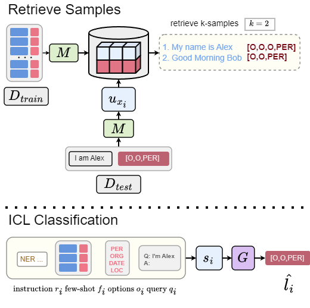

# Extending the MINERS Framework

This fork was developed for Ontario Tech University's CSCI 6720 group project, focusing on extending [MINERS Framework](https://github.com/gentaiscool/miners)'s ICL classification and Deep Passage Retrieval tasks.

<p align="center">
  
</p>

**Group Members:**  
- Alexie Linardatos(alexie.linardatos@ontariotechu.net)
- Madhav Goyani(madhav.goyani@ontariotechu.net)
- Zikun Fu(zikun.fu@ontariotechu.net)
<br>

A 3 minute video summary on this project can be found here: [Link](https://drive.google.com/file/d/1lR5k7jcFGUvkAPnFsebAiF2d00Thnjgb/view?usp=sharing)

The final report can be found here: [Link]()

## 🔧 Environment Setup
```bash
pip install -r requirements.txt
```

**Microsoft Visual C++ 14.0 or greater** is required to run the project. You can download it from [Microsoft's website](https://visualstudio.microsoft.com/visual-cpp-build-tools/).

## 📝 Experiment Logs

Full Experiment logs can be accessed [here](https://drive.google.com/drive/folders/1XtJHbjoHxtYN0Cia0dGCSWMhc3xj84IA?usp=drive_link).

## 🚀 Running Experiments

### ICL Classification
```
❱❱❱ python icl_NER.py --dataset {dataset} --seed 42 --model_checkpoint {model} --gen_model_checkpoint {gen_model_checkpoint}  --cuda --load_in_8bit --k {k}
❱❱❱ python icl_NER.py --dataset masakhaner --seed 42 --model_checkpoint sentence-transformers/LaBSE --gen_model_checkpoint meta-llama/Meta-Llama-3.1-8B-Instruct --cuda --load_in_8bit --k 2
```

## 💻 Models Support
All models used for the experiments are listed below:
### Encoder LMs and APIs
#### Open-source LMs:
- [sentence-transformers/LaBSE](https://huggingface.co/sentence-transformers/LaBSE)
- [intfloat/multilingual-e5-base](https://huggingface.co/intfloat/multilingual-e5-base)
- [FacebookAI/xlm-roberta-base](https://huggingface.co/FacebookAI/xlm-roberta-base)

### Generative LMs:
- Gemma 2 Instruct [google/gemma-2-9b-it](https://huggingface.co/google/gemma-2-9b-it)
- Llama 3 8B Instruct [meta-llama/Meta-Llama-3.1-8B-Instruct](https://huggingface.co/meta-llama/Meta-Llama-3.1-8B-Instruct)

## 📜 Credits

- [**OpenSub bitext mining dataset**](https://huggingface.co/datasets/loicmagne/open-subtitles-bitext-mining)
- [**Masakhaner NER dataset**](https://huggingface.co/datasets/masakhane/masakhaner2)
- Framework code based on the **MINERS paper**:<pre>
@article{winata2024miners,
  title={MINERS: Multilingual Language Models as Semantic Retrievers},
  author={Winata, Genta Indra and Zhang, Ruochen and Adelani, David Ifeoluwa},
  journal={arXiv preprint arXiv:2406.07424},
  year={2024}
}
</pre>
